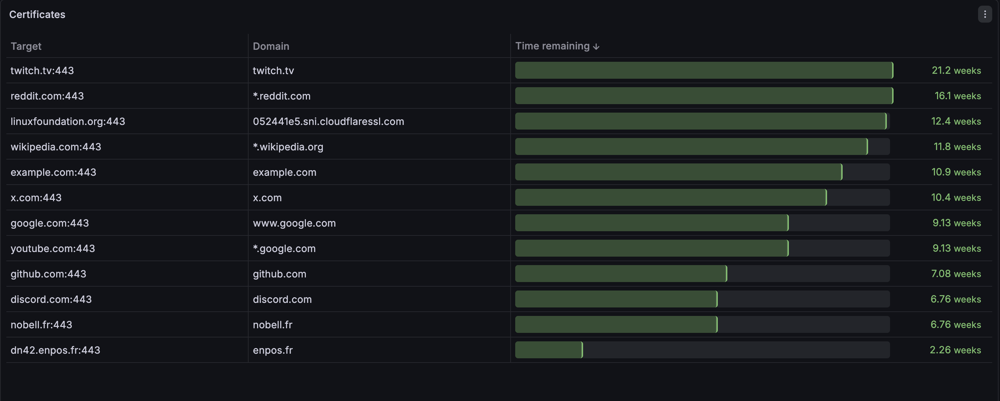

# SSL Exporter

SSL exporter is a simple ssl certificate expiration delay gatherer written in go. \
The expiration delay metrics are defined in seconds and exported for Prometheus on the `/metrics` endpoint. \
A bearer token can be configured for security needs.


## Running SSL exporter
SSL exporter can be runned in a docker container or as a systemd service.
s
### Running on Docker
Install Docker
```bash
curl -fsSL https://get.docker.com | sh
```
Download the docker compose file
```bash
wget https://github.com/janbellon/ssl_exporter/releases/download/v0.1.0/docker-compose.yml
```
Edit the environment variables in `docker-compose.yml`. \
Launch the ssl_exporter container
```bash
docker compose up -d
```

### Running as a systemd service
Download the ssl_exporter binary
```bash
wget https://github.com/janbellon/ssl_exporter/releases/download/v0.1.0/ssl_exporter-linux-amd64
```
Move the binary to bin directory
```bash
mv ssl_exporter* /usr/local/bin/ssl_exporter
```
Copy the systemd service file to systemd directory
```bash
cp ssl_exporter.service /etc/systemd/system/
```
Create a ssl_exporter user
```bash
useradd -M -s /bin/false ssl_exporter
```

Create the ssl_exporter configuration
```bash
mkdir /etc/ssl_exporter
cp config.sample.yaml /etc/ssl_exporter/config.yaml
```

Edit the configuration
```bash
vim /etc/ssl_exporter/config.yaml
```

```yaml
listen:
  host: 0.0.0.0
  port: 9123
  bearer: ""

client:
  timeout: 30

log_level: info
```

## Configuring prometheus
To scrape metrics, add these lines to your `prometheus.yml` file
```yaml
- job_name: ssl-exporter
    metrics_path: /metrics
    scrape_interval: 5m
    scrape_timeout: 30s
    static_configs:
        - targets:
            - example.com:443
            - google.com:443
            - api.mycompany.com:8443

    authorization:
        type: Bearer
        credentials: "changeme"

    relabel_configs:
        - source_labels: [__address__]
        target_label: __param_target

        - source_labels: [__param_target]
        target_label: instance

        - target_label: __address__
        replacement: ssl-exporter:9123  # Replace with your ssl_exporter endpoint
```

## Grafana sample dashboard
A Grafana dashboard is available in `grafana_dashboard.json`
Import new dashboard in Grafana and paste file's content in the json input.
